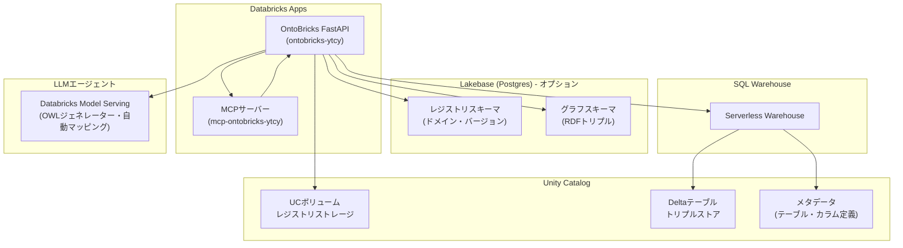

<p align="center">
  
</p>

<h1 align="center">OntoBricks 0.4.0</h1>

<p align="center">
  <strong>Databricks向けデジタルツインビルダー</strong>
</p>

<p align="center">
  
  
  
</p>

---

> **このフォークについて**
> このリポジトリは [databrickslabs/ontobricks](https://github.com/databrickslabs/ontobricks) を日本語対応させたフォークです。UIのラベル、メッセージ、ドキュメントをすべて日本語に翻訳しています。
> デプロイ先: https://ontobricks-ytcy-7474645908464260.aws.databricksapps.com

---

## プロジェクト概要

OntoBricksはDatabricksテーブルを実体化されたナレッジグラフに変換するWebアプリケーションです。オントロジー（OWL）を設計し、R2RMLでUnity Catalogテーブルにマッピングし、Delta対応トリプルストアとLakebase Postgresグラフエンジンにトリプルを実体化し、グラフに対して推論（OWL 2 RL、SWRL、SHACL）を実行し、自動生成されたGraphQL APIでクエリできます。メタデータのインポートからクエリ可能なナレッジグラフまでのパイプライン全体を、LLMによる自動化を使ってわずか4クリックで実行できます。

## プロジェクトサポート

このプロジェクトは `/databrickslabs` GitHubアカウントの探索用として提供されており、Databricksによる正式なサポート（SLA）はありません。AS-ISで提供され、いかなる保証もありません。

問題を発見した場合はリポジトリのGitHub Issuesに報告してください。時間の許す限りレビューされますが、公式SLAはありません。

---

## アーキテクチャ



### レイヤー構成

```
HTTPリクエスト
    ↓
FastAPIルート (src/api/, src/back/routes/)
    ↓
ドメインクラス (src/back/objects/)
    ├── Ontology   — OWL/RDFS/SHACL設計
    ├── Mapping    — R2RML生成・SQL検証
    ├── DigitalTwin — ナレッジグラフ同期・SPARQL
    ├── Domain     — UCへの保存・読み込み
    └── Registry   — ドメインカタログ
    ↓
コアインフラ (src/back/core/)
    ├── SQLWarehouse — Databricks SQLコネクタ
    ├── LakebaseAuth — Postgres JWT認証
    ├── GraphDB      — トリプルストア抽象レイヤー
    └── AgentClient  — LLMエージェント呼び出し
```

---

## 前提条件

- Python 3.10以上
- Databricks Apps が有効なワークスペース
- SQLウェアハウス（IDが必要）
- **Unity Catalog ボリューム**（ドメインレジストリ用）
- **Databricks Lakebase Autoscaling**（v0.4.0以降、レジストリとグラフDB用。省略可能 — ボリュームのみモードで動作）
  > ⚠️ **注意**: Lakebase Autoscaling は 2026年6月時点で **AWS ap-northeast-1 リージョンでは未提供**。そのため本リポジトリのデフォルトデプロイターゲットは `dev`（ボリュームのみモード）に設定されている。Lakebase が ap-northeast-1 で利用可能になった場合は `DEFAULT_DAB_TARGET="dev-lakebase"` に変更すること（`scripts/deploy.config.sh` 参照）。
- Databricks CLI >= 1.0.0（`brew install databricks`）

---

## ビルド方法

```bash
# リポジトリのクローン
git clone https://github.com/ytsuchiya-work/ontobricks.git
cd ontobricks

# 依存関係のインストール（uvを使用）
uv sync

# またはセットアップスクリプトを使用
scripts/setup.sh
```

---

## デプロイ方法

### ローカル開発

```bash
# 認証情報の設定
cp .env.example .env
# .envにDatabricksホスト、トークン、ウェアハウスIDを記入

# アプリの起動
scripts/start.sh
# http://localhost:8000 を開く
```

### Databricks Appsへのデプロイ

```bash
# Databricks CLIのインストールと認証
brew install databricks
databricks auth login --host https://<ワークスペースURL>

# scripts/deploy.config.sh を編集して以下を設定:
# - DEFAULT_APP_NAME: アプリ名
# - DEFAULT_WAREHOUSE_ID: SQLウェアハウスのID
# - DEFAULT_REGISTRY_CATALOG: Unity Catalogのカタログ名
# - DEFAULT_REGISTRY_SCHEMA: スキーマ名

# デプロイ実行（ボリュームのみモード — Lakebase不要）
PATH=/opt/homebrew/bin:$PATH DATABRICKS_CONFIG_PROFILE=<プロファイル名> make deploy-volume

# またはLakebase Postgresモード（フル機能）
PATH=/opt/homebrew/bin:$PATH DATABRICKS_CONFIG_PROFILE=<プロファイル名> make deploy
```

#### このリポジトリの設定値（fevm-classic-stable-ytcy ワークスペース）

| 設定 | 値 |
|------|-----|
| Databricks Host | `https://fevm-classic-stable-ytcy.cloud.databricks.com` |
| SQL Warehouse ID | `e351c2d1b16eae95` |
| カタログ | `classic_stable_ytcy_catalog` |
| スキーマ | `ontobricks` |
| ボリューム | `registry` |
| アプリ名 | `ontobricks-ytcy` |
| MCPアプリ名 | `mcp-ontobricks-ytcy` |
| アプリURL | https://ontobricks-ytcy-7474645908464260.aws.databricksapps.com |

#### デプロイ後の初期設定

1. **リソースのバインド確認**: Databricks Apps UI で「Compute > Apps > ontobricks-ytcy > Resources」を確認し、`sql-warehouse` と `volume` がバインドされているか確認
2. **レジストリの初期化**: アプリを開いて「設定 > レジストリ」タブで「初期化」をクリック
3. **ヘルスチェック**: `https://<アプリURL>/healthz` が HTTP 200 を返すことを確認

---

## アプリの使用方法

### 自動化パイプライン（4クリック）

| ステップ | 操作 | 内容 |
|----------|------|------|
| **1** | **メタデータのインポート**（ドメイン > データソース） | Unity Catalogからテーブルとカラムのメタデータを取得 |
| **2** | **オントロジーの生成**（オントロジー > 生成） | LLMがメタデータからエンティティ・リレーションシップ・属性を設計 |
| **3** | **自動マッピング**（マッピング > 自動マッピング） | LLMがすべてのエンティティとリレーションシップのSQLマッピングを生成 |
| **4** | **同期**（デジタルツイン > 概要） | マッピングを実行してトリプルストアにデータを格納 |

### 手動ワークフロー

1. **オントロジーを設計** — OntoVizキャンバスで視覚的にオントロジーを作成、またはOWL/RDFS/業界標準（FIBO、CDISC、IOF）をインポート
2. **マッピング** — オントロジーのエンティティをDatabricksテーブルにカラムレベルでマッピング
3. **デジタルツインのビルド** — トリプルストアにトリプルを実体化（デフォルトは増分更新）
4. **クエリ** — GraphQLプレイグラウンドで照会、またはインタラクティブなナレッジグラフを探索
5. **推論** — OWL 2 RL推論、SWRLルール、SHACLバリデーション、制約チェックを実行

### 画面の説明

#### ホーム画面
- **現在のドメイン**: 読み込まれているドメイン名と統計（エンティティ数、リレーションシップ数、マッピング数）
- **ワークフローカード**: 3ステップのパイプライン進捗を視覚的に確認
- **クイック操作**: 新規作成、管理、データソース、保存、読み込み

#### レジストリ
- **参照**: 保存されているドメインの一覧と検索
- **チーム**: ドメインごとのアクセス権限管理（管理者のみ）
- **スケジューラ**: 自動同期ジョブの設定

#### ドメイン
- **情報**: ドメイン名・説明・ベースURIの設定
- **バージョン**: ドメインのスナップショット管理
- **コックピット**: オントロジー・マッピング・同期の準備状況ダッシュボード
- **データソース**: Unity Catalogのカタログ・スキーマ・テーブルをインポート
- **ドキュメント**: PDFや参考資料を添付（LLM用コンテキスト）

#### オントロジー
- **デザイナー**: ドラッグ＆ドロップでエンティティとリレーションシップを設計（OntoVizキャンバス）
- **生成**: LLMによるオントロジーの自動生成（AIウィザード）
- **インポート**: OWL/RDFS/業界標準のインポート
- **データ品質**: SHACL制約の定義
- **ビジネスルール**: SWRL推論ルールの作成

#### マッピング
- **デザイナー**: オントロジーグラフ上でノードをクリックしてマッピング設定
- **手動**: マッピング状態でグループ化されたツリー表示
- **自動マッピング**: LLMによる一括SQLマッピング生成
- **診断**: マッピングの一貫性チェック

#### デジタルツイン
- **概要**: エンティティ数・リレーションシップ数・最終同期日時・品質状態のダッシュボード
- **ナレッジグラフ**: インタラクティブなsigma.js WebGLグラフ。検索・フィルタ・クラスター検出
- **GraphQL**: 自動生成されたGraphQLプレイグラウンド
- **推論**: OWL 2 RL推論とSWRLルール実行

### ナレッジグラフの操作

| 操作 | 説明 |
|------|------|
| クリック | ノードを選択・ハイライト |
| ドラッグ（背景） | グラフをパン |
| スクロール | ズームイン/アウト |
| 右クリック（ノード） | コンテキストメニュー（詳細・ブリッジ・展開） |
| ホバー（ノード） | 隣接ノードをハイライト |

---

## MCP統合

OntoBricksはModel Context Protocol（MCP）を通じてLLMエージェントにナレッジグラフを公開します。

```bash
# MCPサーバーのデプロイ
make deploy-mcp

# Cursor、Claude Desktop、またはDatabricks Playgroundから接続可能
```

---

## キーボードショートカット

| ショートカット | 操作 |
|--------------|------|
| `Cmd/Ctrl + S` | 現在のドメインを保存 |
| `Cmd/Ctrl + K` | サイドバー検索にフォーカス |
| `?` | キーボードショートカット一覧を表示 |
| `Esc` | アクティブなオーバーレイ/モーダルを閉じる |

---

## 発生したエラーと解決方法

### デプロイ時のエラー

#### エラー1: `legacy databricks CLI detected; upgrade to >= 0.100.0`

**状況**: `make deploy` 実行時にTerraformが古いCLIを検出してデプロイ失敗

**原因**: `DATABRICKS_CLI_PATH` 環境変数がvirtualenv内の古いDatabricks CLI（v0.18.0）を指していた。新しいCLI（v1.1.0）がTerraform経由でデプロイするとき、PATHの先頭にある古いCLIが選ばれてしまう。

**解決方法**:
```bash
# PATHを調整して新しいCLIを優先させる
PATH=/opt/homebrew/bin:$PATH DATABRICKS_CONFIG_PROFILE=<プロファイル名> make deploy-volume
```

**補足**: `DATABRICKS_CLI_PATH=` で空にするだけでは不十分。PATHの順序を変える必要がある。

---

#### エラー2: `Unable to authenticate: stored credentials from older CLI versions are no longer used`

**状況**: `databricks auth describe` で認証エラー

**原因**: 以前のCLIバージョンで保存された認証情報が新しいCLIと互換性がない

**解決方法**:
```bash
databricks auth login --host https://<ワークスペースURL> -p <プロファイル名>
```

---

#### エラー3: `volumes create` コマンドのフラグエラー

**状況**: `databricks volumes create --catalog-name ...` でエラー

**原因**: Databricks CLI v1.1.0では位置引数を使用する

**解決方法**:
```bash
# 正しい形式
databricks volumes create CATALOG_NAME SCHEMA_NAME VOLUME_NAME MANAGED -p <プロファイル名>
```

---

### アプリ動作時のエラー

#### エラー4: アクセス拒否ページ（`bootstrap` 理由）

**状況**: 初回デプロイ後にすべてのユーザーがアクセス拒否ページを見る

**原因**: アプリのサービスプリンシパルに自身のアプリへの `CAN_MANAGE` 権限がない

**解決方法**:
```bash
# make deploy / make deploy-volume では自動実行されるが、
# databricks bundle deploy を直接使った場合は手動実行が必要
make bootstrap-perms
```

---

#### エラー5: レジストリが空 / ドメインが表示されない

**状況**: アプリを開いてもドメイン一覧が空

**解決方法**:
1. 「設定」→「レジストリ」タブを開く
2. 「初期化」ボタンをクリック

---

#### エラー6: SQLウェアハウスアイコンがグレー/黄色

**解決方法**:
1. 「設定」→「Databricks」タブを開く
2. 適切なウェアハウスを選択して保存
3. ウェアハウスが `RUNNING` 状態になるまで待機

---

## リリース手順

```bash
# 1. テストの実行
make test

# 2. pyproject.tomlのバージョンを更新

# 3. コミットとタグ
git add -A && git commit -m "Release vX.Y.Z"
git tag vX.Y.Z
git push origin main --tags

# 4. デプロイ
PATH=/opt/homebrew/bin:$PATH make deploy-volume
```

---

## プロジェクト構造

```
ontobricks/
├── src/
│   ├── api/              # REST API エンドポイント
│   ├── back/
│   │   ├── core/         # インフラ（SQLWarehouse、LakebaseAuth、GraphDB）
│   │   ├── objects/      # ドメインクラス（Ontology、Mapping、DigitalTwin）
│   │   └── routes/       # FastAPIルート
│   ├── front/
│   │   ├── config/       # menu_config.json（日本語翻訳済み）
│   │   ├── static/       # JS、CSS、画像
│   │   └── templates/    # Jinja2テンプレート（日本語翻訳済み）
│   ├── agents/           # LLMエージェント実装
│   ├── shared/           # 共有ユーティリティ
│   └── mcp-server/       # MCPコンパニオンサーバー
├── scripts/
│   ├── deploy.sh         # デプロイオーケストレーター
│   ├── deploy.config.sh  # デプロイ設定（ワークスペース固有）
│   └── bootstrap-*.sh    # 権限ブートストラップスクリプト
├── tests/                # テストスイート
├── docs/                 # ドキュメント
├── databricks.yml        # Databricks Asset Bundle設定
└── app.yaml.template     # Databricks Apps設定テンプレート
```

---

## 技術スタック

| レイヤー | 技術 |
|----------|------|
| バックエンド | Python 3.10+、FastAPI、RDFLib、OWL-RL、Strawberry GraphQL |
| フロントエンド | Jinja2、Bootstrap 5.3、バニラJS、Sigma.js、Graphology |
| プラットフォーム | Databricks Apps、Unity Catalog、SQLウェアハウス |
| LLM | Databricks Model Serving（OWLジェネレーター、自動マッピング） |
| グラフDB | Lakebase Postgres（オプション）またはDelta（トリプルストア） |
| プロトコル | MCP、R2RML、OWL 2、SHACL、SWRL |

---

## ドキュメント

詳細なドキュメントは [`docs/`](docs/README.md) で確認できます。

- [デプロイガイド](docs/deployment.md)
- [Lakebase GraphDB](docs/lakebase-graphdb.md)
- [レジストリのインポート/エクスポート](docs/import-export.md)
- [コホート発見](docs/cohort_discovery.md)
- [完全なフィーチャーリスト](docs/INFO.md)

---

## ライセンス

[Databricksライセンス](LICENSE.txt)参照

---

*このリポジトリはOntoBricksの日本語対応フォークです。元のプロジェクトは [databrickslabs/ontobricks](https://github.com/databrickslabs/ontobricks) で公開されています。*
